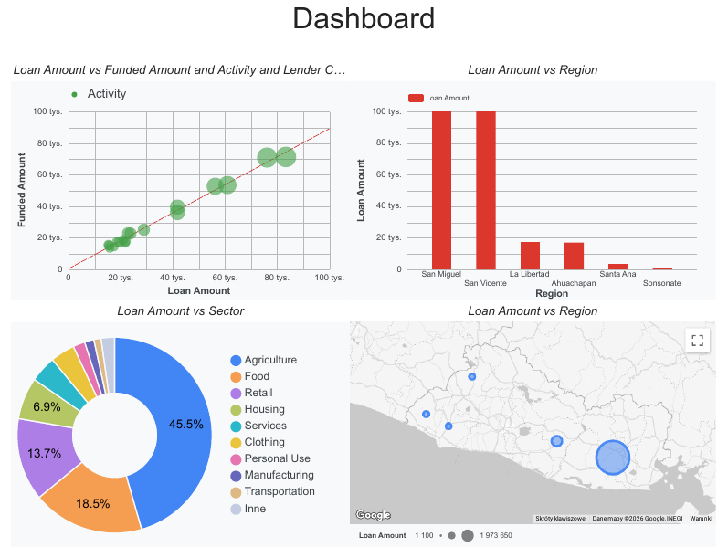

# Google Looker Studio
Google Looker Studio Technical Showcase: Kiva_El

### 📊 Project Overview
This project was created to demonstrate proficiency in **Google Looker Studio** as part of my Data Science & Machine Learning bootcamp. The primary focus was on mastering the end-to-end business intelligence workflow, from data ingestion to interactive dashboarding.

### 🖼️ Dashboard Preview

### 📂 Files
* [**View Report (PDF)**](https://lookerstudio.google.com/s/mQRG0JVN0rQ) - A static export of the final visualization.

---
*Created by jposluszny as part of a Data Science & ML training path.*